# Borrador para el proyecto de delivery tambo


## Vista Previa

### Página principal

- 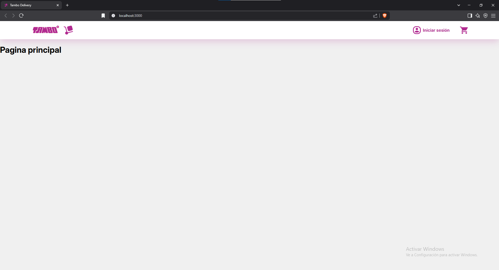

### Página de inicio de sesión

- 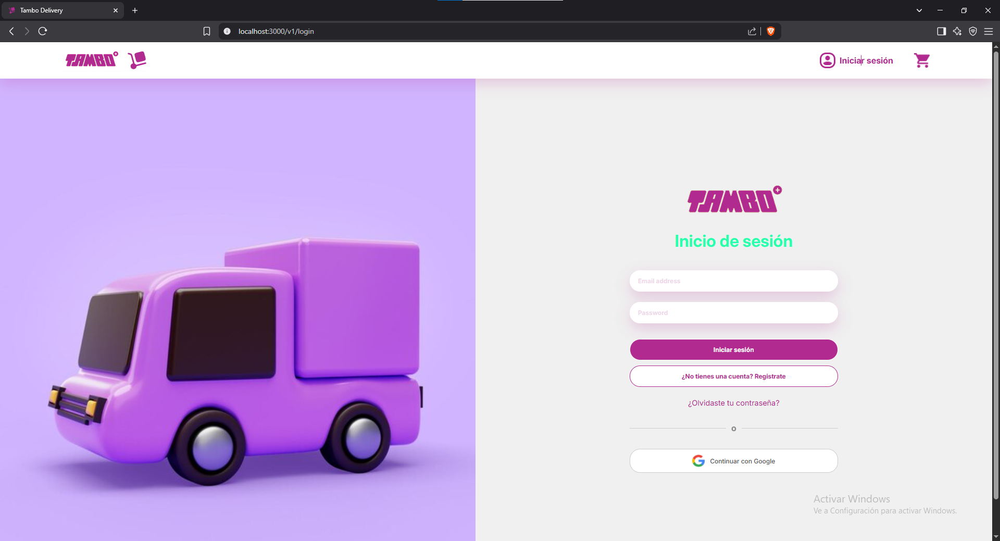

### Página de regitro

- 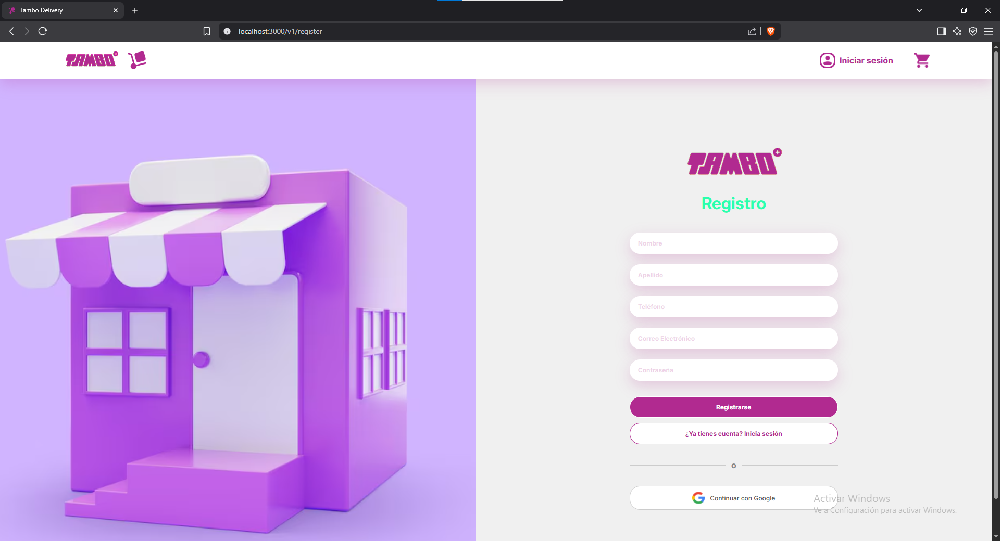

### Página para restablecer contraseña

- 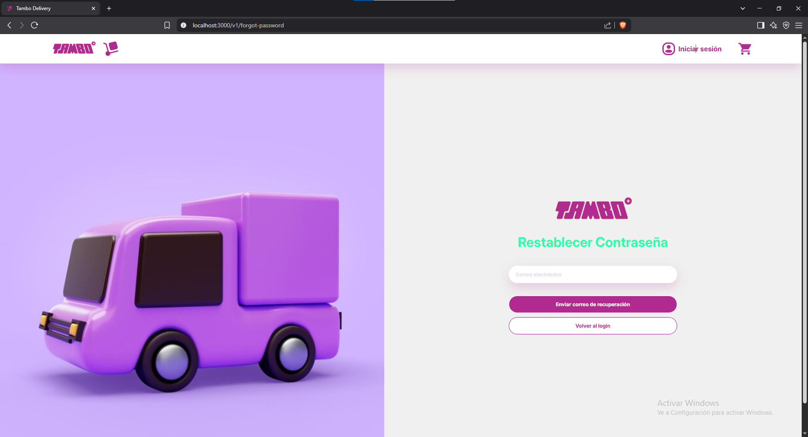

## ☕ Requisitos para el proyecto

Antes de compilar y ejecutar este backend y fronted, asegúrate de tener instalado y configurado lo siguiente:

### ✅ Java 21

Spring Boot 3.4.5 requiere **Java 21**. Puedes descargarlo desde el sitio oficial de Oracle o utilizar una distribución alternativa como OpenJDK (Adoptium).

#### 🔧 Configurar JAVA_HOME

1. Verifica que Java esté instalado:

```bash
java -version
```

2. Configura la variable de entorno `JAVA_HOME`:

**Linux/macOS:**

Agrega a tu archivo `~/.bashrc`, `~/.zshrc` o similar:

```bash
export JAVA_HOME=/ruta/a/java-21
export PATH=$JAVA_HOME/bin:$PATH
```

**Windows:**

- Ve a _Configuración del sistema > Variables de entorno_.
- Crea una nueva variable `JAVA_HOME` apuntando al directorio de instalación de Java.
- Agrega `%JAVA_HOME%\bin` a la variable `Path`.

#### 🎥 Tutorial en YouTube

[](https://www.youtube.com/watch?v=4WKo13f2Qpc)

### 📦 Maven

Maven es el sistema de construcción utilizado para compilar y gestionar dependencias del proyecto Spring Boot.

#### 📥 Instalar Maven

Puedes descargar Maven desde: https://maven.apache.org/download.cgi

Verifica la instalación con:

```bash
mvn -version
```

#### 🔧 Configurar MAVEN_HOME

**Linux/macOS:**

```bash
export MAVEN_HOME=/ruta/a/maven
export PATH=$MAVEN_HOME/bin:$PATH
```

**Windows:**

- Agrega `MAVEN_HOME` como variable de entorno.
- Añade `%MAVEN_HOME%\bin` al `Path`.

#### 🎥 Tutorial en YouTube

[](https://www.youtube.com/watch?v=Rb1hViGAceE)

### 🟢 Node.js y npm

Node.js es un entorno de ejecución para JavaScript en el servidor. npm es su sistema de gestión de paquetes.

- Descarga e instala desde: [https://nodejs.org/](https://nodejs.org/)
- Verifica la instalación:

```bash
node -v
npm -v
```

#### 🎥 Tutorial en YouTube

[](https://youtu.be/iMStDdk5alg)

### 🐬 Servidor MySQL

Necesitas tener un servidor MySQL en funcionamiento para poder almacenar y consultar datos desde la aplicación.

- Descarga e instala desde: [https://dev.mysql.com/downloads/mysql/](https://dev.mysql.com/downloads/mysql/)
- Durante la instalación, configura un usuario y contraseña (por defecto suele ser `root` con una contraseña definida por ti).
- Sugerencia: Establecer como nombre de usuario `root` y contraseña `root`, o de lo contrario, puedes cambiar la propiedad en `Backend\src\main\resources\application.properties` y cambiar en:

  - 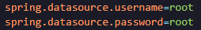

### 🧰 MySQL Workbench (opcional pero recomendado)

MySQL Workbench es una herramienta visual para gestionar tu base de datos MySQL.

- Descárgalo desde: [https://dev.mysql.com/downloads/workbench/](https://dev.mysql.com/downloads/workbench/)
- Te permite visualizar tablas, ejecutar consultas y administrar el servidor fácilmente.

#### 🎥 Tutorial en YouTube

[](https://youtu.be/EmQZt6o6-78)

## 🗄️ Configuración de la Base de Datos

Este proyecto requiere una base de datos llamada `tambo_bd`.

### 📌 Paso 1: Crear la base de datos

Asegúrate de tener instalado un motor la base de datos **MySQL**. Luego, crea la base de datos ejecutando el siguiente comando en tu cliente de base de datos:

#### Ejemplo en MySQL:

```sql
CREATE DATABASE tambo_bd;
```

- 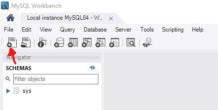
- 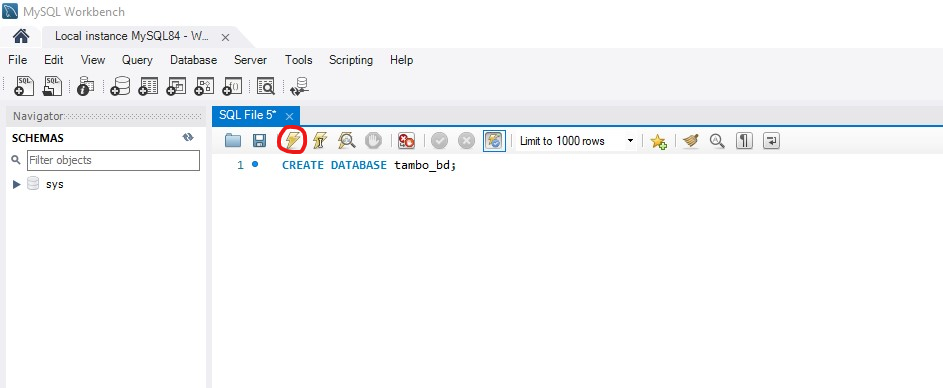
- 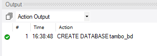
- 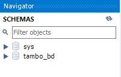

## Extensiones para VSCode

1. Extension Pack for Java

- 

2. Spring Boot Tools

- 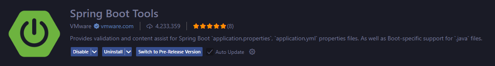

## 📦 Instalación de dependencias esenciales para REACT

Este proyecto utiliza varias librerías fundamentales para manejar enrutamiento, estado global, autenticación y llamadas HTTP. A continuación se detallan las dependencias requeridas y cómo instalarlas con `npm`.

### 🔗 Axios

Cliente HTTP para realizar peticiones al backend.

```bash
npm install axios
```

### 🚦 React Router DOM

Manejo del enrutamiento en la aplicación React.

```bash
npm install react-router-dom
```

### 🧠 React Redux

Integración de Redux con React para manejo de estado global.

```bash
npm install react-redux
```

### 🛠️ Redux Toolkit

Conjunto de utilidades recomendadas para escribir lógica Redux de forma más eficiente y segura.

```bash
npm install @reduxjs/toolkit
```

### 🔐 JWT Decode

Decodificador de tokens JWT del lado del cliente.

```bash
npm install jwt-decode
```

> ✅ **Requisito importante:** Asegúrate de estar utilizando **React 18 o superior** para que `createRoot` desde `react-dom/client` funcione correctamente.

```js
import { createRoot } from "react-dom/client";
```

## 🛠️ Instalación del Proyecto

1. Clona este repositorio:

```bash
git clone https://github.com/tu-usuario/tu-repositorio.git
cd tu-repositorio
```

o desde VsCode

- 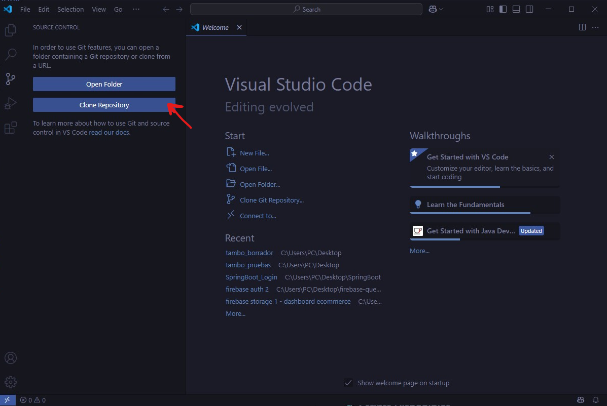

## ▶️ Ejecución del Proyecto

Para evitar problemas con la terminal, abrir visual studio code como `Administrador`

### Backend

1. Abre el terminal en vscode con `Ctrl + ñ`
2. Abre `Command Prompt`
   - 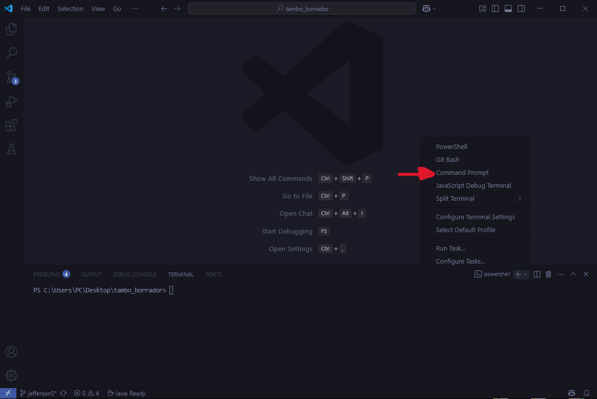
3. Ubicarte en el Backend `cd Backend`
   - 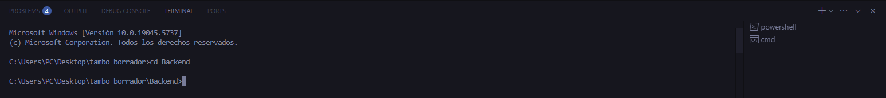
4. Ejecutar spring

   ```bash
   mvn spring-boot:run
   ```

### Fronted

1. Abre otro terminal en vscode con `Ctrl + ñ`
2. Abre `Command Prompt`
   - 
3. Ubicarte en el Fronted `cd Fronted`
   - 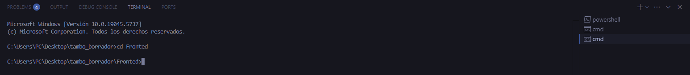
4. Instalar las dependencias

   ```bash
   npm install
   ```

5. Ejecutar react con vite

   ```bash
   npm run dev
   ```

## 🧪 Scripts Disponibles

- `npm run dev`: Inicia el servidor en modo desarrollo.
- `npm run build`: Compila el proyecto para producción.

---
